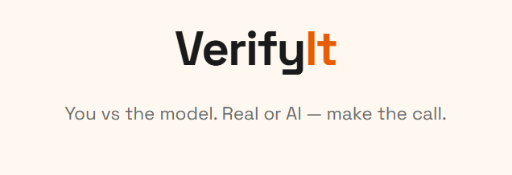

# **VerifyIt 🔍**



> An adaptive web game that challenges you to spot AI-generated videos. Built with an EfficientNet-B0 transfer learning pipeline and a Streamlit frontend. You compete head-to-head against the model — after every guess, the game reveals the AI's prediction, its confidence level, and the ground truth.


🔗 **[Play the game here](https://verifyit-ai-or-real.streamlit.app)**

---

## **📌 Overview**

VerifyIt shows you short video clips and asks one question: **is this AI-generated or real?** After you guess, the game reveals three things — what you said, what the AI model predicted (with its confidence), and the actual answer.

The game adapts to your skill. Answer correctly and the clips get harder. Get it wrong and it eases up. Play as many rounds as you want, then see a full report of how you performed against the AI.

---

## **🧠 How It Was Built**

The project has two parts: a machine learning pipeline and a web app.

**The ML pipeline** (in `notebook/model_training.ipynb`) extracts frames from 66 video clips, trains an EfficientNet-B0 classifier using transfer learning, optimizes the decision threshold, and scores every clip with a difficulty rating. The output is a single JSON file that powers the game. The notebook is heavily commented and walks through every step in detail.

**The web app** (in `game_app.py`) reads that JSON file and runs the game. It handles adaptive difficulty, score tracking, and streams videos from Google Drive. No model inference happens at runtime — everything was precomputed during training.

---

## **✨ Features**

- 🎮 **Adaptive difficulty** — clips get harder as you improve, powered by a hidden skill rating system
- 🤖 **You vs AI** — every round shows the model's prediction and confidence alongside your guess
- 📊 **Performance report** — end-of-game breakdown showing how often you beat the AI and vice versa
- 🎬 **Real video clips** — streamed directly from Google Drive, no downloads needed
- ⚡ **No runtime inference** — all predictions are precomputed, so the app loads instantly

---

## **🛠️ Tech Stack**

| **Layer** | **Tool** |
|---|---|
| Model | EfficientNet-B0 (PyTorch, torchvision) |
| Training Environment | Google Colab |
| Frame Extraction | OpenCV (cv2) |
| Image Processing | Pillow (PIL) |
| Evaluation | scikit-learn (metrics, train/test split) |
| Visualization | matplotlib, seaborn |
| Video URL Extraction | Google Drive API |
| Web App | Streamlit |
| Video Hosting | Google Drive |
| Deployment | Streamlit Community Cloud |
| Language | Python 3.10+ |

---

## **📁 Project Structure**

```
VerifyIt/
├── game_app.py                 # Streamlit web app
├── clip_scores.json            # Precomputed model predictions and difficulty scores
├── requirements.txt            # Dependencies for Streamlit Cloud deployment
├── README.md                   # Project documentation
├── LICENSE                     # MIT License
├── notebook/
│   ├── model_training.ipynb    # Full ML pipeline — frame extraction, training, evaluation, scoring
│   └── url_generation.ipynb    # Google Drive file ID extraction and video URL generation
```

---

## **🚀 Getting Started**

### **Play the deployed game**

No setup needed. Visit the **[live app](https://verifyit-ai-or-real.streamlit.app)** in any browser.

### **Run the game locally**

**1. Clone the repo:**

```bash
git clone https://github.com/Offsideplayer24/VerifyIt.git
cd VerifyIt
```

**2. Create a virtual environment:**

```bash
python -m venv venv
```

Activate it:
- **Windows:** `venv\Scripts\activate`
- **Mac/Linux:** `source venv/bin/activate`

**3. Install dependencies:**

```bash
pip install streamlit
```

**4. Run the app:**

```bash
streamlit run game_app.py
```

The game will open in your browser at `http://localhost:8501`.

### **Retrain the model from scratch**

Open `notebook/model_training.ipynb` in [Google Colab](https://colab.research.google.com).

You will need:

1. The [REAL/AI Video Dataset](https://www.kaggle.com/datasets/kanzeus/realai-video-dataset) from Kaggle
2. A Google Drive folder with the clips organized into `ai/` and `real/` subfolders
3. A GPU runtime is recommended (Runtime → Change runtime type → T4 GPU) but CPU works — training takes ~15–20 minutes on CPU vs ~3–5 minutes on GPU

The following libraries are required (all pre-installed in Colab):

```
torch
torchvision
opencv-python-headless
Pillow
scikit-learn
matplotlib
seaborn
```

The notebook extracts frames, trains the model, optimizes the threshold, scores all clips, and saves `clip_scores.json` to Google Drive.

---

## **📊 Dataset**

[REAL/AI Video Dataset](https://www.kaggle.com/datasets/kanzeus/realai-video-dataset) by kanzeus on Kaggle — 66 video clips (33 AI-generated, 33 real).

---

## **📄 License**

This project is licensed under the MIT License. See [LICENSE](LICENSE) for details.
